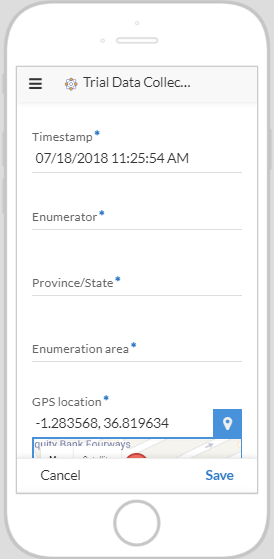

## Problem statement

The CIALCA project has developed a modelling framework to predict response to fertilizer based on local soil conditions and the expected weather during crop growth for a given geolocation and planting date. This has been packaged as a mobile app that allows farmers to make decisions on investment in fertilizer in their farm. The project now aims to validate this tool through a large scheme of farmer-managed trials evaluating the recommendations generated by the app.

The validation will be done with the help of extension agents - approx 300 agents, equipped with mobile phones to collect data from farmers at the time of harves participating in the exercise - each agent supports 10-20 farmers.

It is required to create: (1) a tool for use by the extension agent to collect data on the following variables:
--Planting date;
--GPS location;
--Harvest date;
--Score on weed control (1 = very poor ... 5 = very good control);
--Score by the extension agent on the overall trial performance (1 = poorly managed ... 5 = very well managed);
--Weight of roots collected from the control and fertilizer treatment. 

(2) a dashboard where the results must then be visualized, showing (i) quantity of incoming data on a timeline, (ii) the quality of the data as reflected by the scores on weed control and overall trial performance, and (iii) the observed effects of fertilizer (average and spread). 

## Solution

### Data collection Tool development

In order to support the data collection efforts, a data collection tool was developed using [Appsheet](https://www.appsheet.com), an app maker for mobile apps (see the result [here](https://www.appsheet.com/start/1679a223-65b5-4cb1-b1fb-245ffa6d2dae) or request for the invite). Appsheet was choosen because it allows to collect images, notes, and GPS locations while in the field; lets to connect data tables in Google Sheet to the app.



The developed app is connected to a [Google sheet](https://docs.google.com/spreadsheets/d/1oVzqXuofxvc_BpGfuQ3K_9HnXu-iFKpczphOYBX4l5E/edit?usp=sharing) to collect the form output.


### Dashboard development

To automate the quality control process as well as visualization of results, a simple dashboard was developed using R.

```{r echo=FALSE }
#Loading all packages requred for building the graphs
install.packages("googlesheets")
library(googlesheets)
install.packages("ggplot2")
install.packages("RColorBrewer")
install.packages("grid")
```

```{r echo=FALSE }
#To extract data from the Google sheet (see the link above), R was connected to Google Sheets.
#Authenticating Google account
gs_auth(new_user = TRUE)
#Listing all spreadsheets that I have in the Drive
gs_ls() 
trialTbl <- gs_title("TrialDataCollection")
trialDF <- gs_read(trialTbl)
print(str(trialDF))
```
```{r echo = FALSE}
library(dplyr)
library(ggplot2)
library(RColorBrewer)
#As some columns are bulky, those variables that are needed for the analysis were re-named.
colnames(trialDF)[7] <- "weed"
colnames(trialDF)[8] <- "trialPerformance"
colnames(trialDF)[9] <- "weight"
colnames(trialDF)[10] <- "type"
#The timestamp column captures the moment an agents uses the app, including a second, a minute, an hour, a day, a month, and year. In order to aggregate the results by day, seconds, minutes and hours were removed from the timestamp.
trialDF$Timestamp <- as.Date(trialDF$Timestamp, format('%m/%d/%Y'))
trialFreq <- as.data.frame(table(trialDF$Timestamp)) 
#The frequency table based on one variable was built in order to construct the time series graph for collecting a data stream.
trialFreq$Freq <- as.numeric(as.character(trialFreq$Freq))
pl1<- ggplot(data=trialFreq, aes(x=Var1, y= Freq,  group=1)) +
  geom_line()+
  geom_point() +
  ggtitle("# of submitted forms by date") +
  labs(y="# of forms",x="Date")
#The frequency table based on two variables (Timestamp & Weed content) was built to check quality of the data as reflected by the scores on weed control 
trialFreqWeed<- rename(count(trialDF, Timestamp, weed), Freq = n)
pl2<- ggplot() + 
  geom_bar(aes( y=Freq, x = Timestamp, fill=factor(weed)), 
           data = trialFreqWeed,
           stat="identity") +
  scale_fill_brewer(palette = "RdYlGn") +
  ggtitle("# of submitted forms and weed score" )+
  labs(y="# of forms",x="Date", fill="Score")
#The frequency table based on two variables (Timestamp & Trial Performance) was built to check quality of the data as reflected by the scores on overall trial performance
trialFreqFert<- rename(count(trialDF, Timestamp, trialPerformance), Freq = n)
pl3<- ggplot() + 
  geom_bar(aes( y=Freq, x = Timestamp, fill=factor(trialPerformance)), 
           data = trialFreqFert,
           stat="identity") +
  scale_fill_brewer(palette = "RdYlGn") +
  ggtitle("# of submitted forms and trial performance" )+
  labs(y="# of forms",x="Date", fill="Score")
#In order to monitor the observed effects of fertilizer (average and spread), the subset of data was created by specifying that we want only treatment records to be included.
trialSubset <- trialDF[trialDF$type == "t", ]
pl4 <- ggplot(trialSubset, aes(factor(Timestamp), weight)) +
      geom_boxplot() +
      labs(y="weight",x="Date") +
    ggtitle("Observed effects of fertilizers") 
```

```{r echo=FALSE }
library(grid)
multiplot <- function(..., plotlist=NULL, file, cols=1, layout=NULL) {
  # Make a list from the ... arguments and plotlist
  plots <- c(list(...), plotlist)
  
  numPlots = length(plots)
  
  # If layout is NULL, then use 'cols' to determine layout
  if (is.null(layout)) {
    # Make the panel
    # ncol: Number of columns of plots
    # nrow: Number of rows needed, calculated from # of cols
    layout <- matrix(seq(1, cols * ceiling(numPlots/cols)),
                     ncol = cols, nrow = ceiling(numPlots/cols))
  }
  
  if (numPlots==1) {
    print(plots[[1]])
    
  } else {
    # Set up the page
    grid.newpage()
    pushViewport(viewport(layout = grid.layout(nrow(layout), ncol(layout))))
    
    # Make each plot, in the correct location
    for (i in 1:numPlots) {
      # Get the i,j matrix positions of the regions that contain this subplot
      matchidx <- as.data.frame(which(layout == i, arr.ind = TRUE))
      
      print(plots[[i]], vp = viewport(layout.pos.row = matchidx$row,
                                      layout.pos.col = matchidx$col))
    }
  }
}
multiplot(pl1, pl2, pl3, pl4, layout = matrix(c(1, 2, 3, 4), nrow = 2))
```

